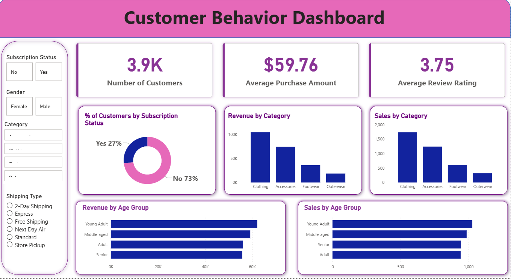

# 🛍️ Customer Behavior Analysis


---

## 📷 Dashboard Preview

<p align="center">
  
</p>

---

## 📌 Project Overview

This project performs **Exploratory Data Analysis (EDA)** on customer shopping data to uncover purchasing patterns, customer preferences, and sales trends. Using Python and powerful data visualization libraries, the analysis transforms raw customer data into meaningful business insights that support customer segmentation, marketing strategies, and business decision-making.

---

## 🎯 Objectives

- Clean and preprocess customer shopping data.
- Analyze customer demographics and purchasing behavior.
- Discover shopping trends across product categories and seasons.
- Visualize customer insights using charts and graphs.
- Generate actionable business recommendations based on data analysis.

---

## 📂 Dataset

The dataset contains customer shopping information, including:

- Customer ID
- Age
- Gender
- Item Purchased
- Product Category
- Purchase Amount (USD)
- Payment Method
- Shipping Type
- Season
- Subscription Status
- Review Rating
- Discount Applied
- Promo Code Used
- Frequency of Purchases

---

## 🛠️ Tech Stack

- Python
- Pandas
- NumPy
- Matplotlib
- Seaborn
- Jupyter Notebook

---

## 📊 Project Workflow

1. Import Libraries
2. Load Dataset
3. Data Cleaning & Preprocessing
4. Exploratory Data Analysis (EDA)
5. Data Visualization
6. Customer Behavior Analysis
7. Business Insights & Recommendations

---

## 📈 Analysis Performed

- Customer Demographics Analysis
- Age Distribution Analysis
- Gender-wise Purchase Analysis
- Product Category Analysis
- Purchase Amount Distribution
- Seasonal Shopping Trends
- Subscription Status Analysis
- Payment Method Analysis
- Shipping Preference Analysis
- Discount & Promo Code Analysis
- Customer Rating Analysis
- Correlation Analysis

---

## 📊 Key Insights

- Identified the most frequently purchased product categories.
- Compared purchasing behavior across different age groups and genders.
- Analyzed the impact of discounts and promotional offers.
- Evaluated preferred payment methods and shipping options.
- Explored seasonal buying trends.
- Identified customer purchasing patterns to support marketing strategies.
- Generated actionable insights for data-driven business decisions.

---

## 📁 Project Structure

```text
customer-behavior-analysis/
│
├── Customer_Behaviour_Analysis.ipynb
├── shopping_trends.csv
├── dashboard.png
├── requirements.txt
└── README.md
```

---

## 🚀 Getting Started

### Clone the Repository

```bash
git clone https://github.com/harshalgit2005/customer-behavior-analysis.git
```

### Navigate to the Project

```bash
cd customer-behavior-analysis
```

### Install Dependencies

```bash
pip install -r requirements.txt
```

### Launch Jupyter Notebook

```bash
jupyter notebook
```

Open **Customer_Behaviour_Analysis.ipynb** and run all cells to reproduce the complete analysis.

---

## 🔮 Future Improvements

- Develop an interactive Power BI dashboard.
- Perform Customer Segmentation using K-Means Clustering.
- Implement RFM Analysis.
- Build Customer Churn Prediction models.
- Deploy the project using Streamlit.

---

## 👨‍💻 Author

**Harshal Saudagar**

- GitHub: https://github.com/harshalgit2005

---

## ⭐ Support

If you found this project useful, consider giving it a ⭐ on GitHub. Your support helps others discover the project and motivates future work.